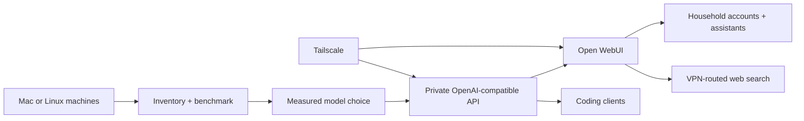

# Household AI

[](https://github.com/rogerchappel/household-ai/actions/workflows/validate.yml)
[](LICENSE)
[](ROADMAP.md)


**Turn the computers you already own into a private AI service for your whole
household—selected by measurement, not model hype.**

Household AI inventories compatible machines, benchmarks local models on the
actual hardware, evaluates useful behaviour, and helps promote the winner into
a private service. The result can support everyday chat, live web research,
coding tools, and separate assistants for different people or purposes.

It is open source under Apache 2.0, including commercial use.

## What it builds



The reference setup keeps inference and the web interface on your own machines.
Tailscale provides private remote access without opening the service to the
public internet. Optional SearXNG search can send external traffic through a
VPN while local conversations remain local.

## Who it is for

- Households that want one useful private AI service rather than a developer
  demo on each computer.
- People with Apple Silicon Macs or Ubuntu mini PCs who want evidence about
  which model their hardware can run well.
- Developers who want the same local model available to OpenAI-compatible
  coding clients.
- Technical helpers using Codex, Claude Code, or a similar coding agent to guide
  a less technical owner through a reviewed setup.

## Tested version 0.1 path

The first release deliberately supports a small surface area:

| Platform | Tested runtime | Role | Status |
| --- | --- | --- | --- |
| Apple M4, 24 GB unified memory | MLX and llama.cpp Metal | Chat, review, smaller models | Verified |
| Ubuntu 24.04, Ryzen 9 8945HS, Radeon 780M, 64 GB RAM | llama.cpp Vulkan | Larger MoE models, primary inference | Verified |
| Other Apple Silicon or similar Ubuntu AMD systems | Same paths | Hardware-dependent | Expected |
| Windows, NVIDIA, Intel accelerators | — | Future work | Not supported in v0.1 |

Our anonymised reference tests favored a quantized 30B-class mixture-of-experts
coding model on the 64 GB Linux node: it kept most weights in system memory and
used the integrated GPU where useful. That result is an example, not a universal
recommendation—context size, concurrency, thermals, quality, and memory headroom
all affect the right choice. See the
[reference benchmark](examples/reference-benchmark.md).

## Start here

Household AI is currently an agent-assisted preview, not an unattended
one-command installer. You stay in control of package installation, model
downloads, authentication, networking, and service changes.

1. Read the [getting-started guide](docs/getting-started.md).
2. Run the local, read-only preflight check:

   ```bash
   bash scripts/preflight.sh
   ```

3. Give the included
   [`household-ai-installer` skill](skills/household-ai-installer/SKILL.md) to
   your coding agent, or follow the documentation manually.
4. Inventory each machine, shortlist models, and approve downloads.
5. Benchmark speed, memory fit, quality, and independent judgment.
6. Promote the accepted configuration, then deploy the private household UI.

The full workflow is indexed in [the documentation](docs/README.md).

## What is included

```text
hardware/     Privacy-safe machine inventory
benchmarks/   Comparable llama.cpp and MLX benchmark runners
evals/        Synthetic coding and independent-judgment cases
evaluations/  Local evaluation and result validation
deploy/       Open WebUI, SearXNG, VPN, and model-service templates
examples/     Sanitised reference evidence
skills/       Agent-assisted installation workflow
docs/         Setup, safety, promotion, and operations guidance
```

## Privacy and safety boundary

The repository contains templates and anonymised examples—not model weights,
API keys, VPN credentials, household chats, private prompts, user mappings, or
knowledge bases. Treat model output and web content as untrusted. Security,
authentication, firewall, VPN, boot-service, destructive, and persistent-data
changes require explicit owner review.

Use Tailscale **Serve**, not Funnel, for private access. Never commit a completed
`.env` file or a private SSH key.

## Project status

Version 0.1 is a public preview being extracted from a working two-machine
deployment. The benchmark, evaluation, promotion, and deployment paths exist;
clean-machine onboarding and recovery coverage are still being hardened before
the first tagged release. See the [roadmap](ROADMAP.md) and
[changelog](CHANGELOG.md).

Contributions and commercial use are welcome. Please read
[CONTRIBUTING.md](CONTRIBUTING.md), [SECURITY.md](SECURITY.md), and the
[Apache 2.0 license](LICENSE).
